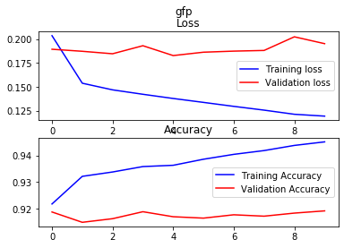
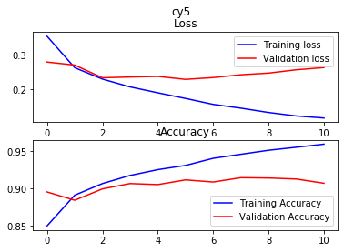
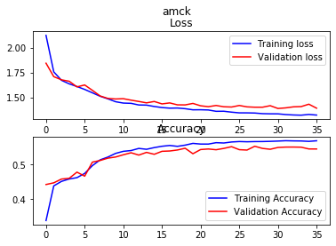
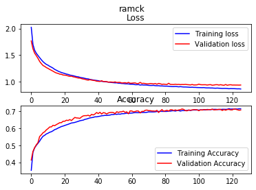

## Project and main ideas
Cell type classification is used in drug target discovery as well as drug discovery, but identifying cell types can prove to be difficult and time consuming. The way we define cell types is by using a combination of pharmacology, structural identification, and transcriptomics (a omniscient assay providing every gene expressed in each cell) to define these cell types. Here in our assay we define the cells mainly using two different assays. This is most easily explained in a [video](https://youtu.be/Ff1E0l2Zlhw?t=342), and for a more in depth discussion on the entire ramifications of this assay.
1.	Dynamic depiction:  This is captured by filling the neurons with Fura2, a dye indicative of calcium. Calcium indicates when specific channels (targets of pharmacological intervention) open up. An image is captured every two seconds during these experiments.
2.	Static depiction: neurons can be defined by structural and genetic labeling techniques to help define further what defines these neurons. In this assay we have 2 different markers of pain (see video 2), as well as size characteristics.

Automatically identifying these depictions to define the neurons cell class has been intensely worked on for the past three years, but a few questions still emerge from this work;
1.	Can this process become completely automated?
2.	Can we gain insight from the automation?

Often when using deep neural networks the interpretability is negligent. Although advances have been made with gradient ascent, obtaining information and structure from this type of work can be difficult. The approach made here is to design a structure of prediction from a compilation of multiclass neural networks to define which model performed the best.

## Methods

### Data prep
Twenty different experiments were used for this [experiment](./rawData/multiClassData), and an additional [ten](./rawData/binaryClassData) were added for the binary classification problem discussed later.  Experiments are composed as R lists (equivalent to python dictionaries). Within the list are time series data (what we will refer to as traces), and images. 

1.	Image prep: The images are dimension 2048 x 2048 with the images ~ > 2000 cells are captured in a single image. Each neuron (>1000) was selected from each image (20) to have dimensions 41 x 41 pixels. These images were saved as single dimensional numpy array to be unpacked in python to perform the model training. For a collection of the training data see [here](./trainingData). To extract each individual image the experiment were first cleaned using [this script](./dataPrep.R), at the end of that script the function [imageExtractor](./imageExtractor.R) was used.
2. Trace prep: Traces (see earlier video) mean pixel intensities collected across the total area of the cell while different application of pharmacological agents are applied to the cell. This is transformed into a time series array. One issue was each experiment had differing number of time points for the same application. To deal with this issue the minimun total time points we found across all experiments. Each experiments time series time points were deleted at regular intervals to equal the minimum allowed size. This proved more difficult and the script can be found [here](./R/traceExtractor.R).

To define neurons within the cell classification cell types five different pharmacological agents were applied to the neurons (the video above does the best job of describing this). These five pharmacological agents define the ion channel and receptors present on these neurons which are inherent characteristics defining these neurons. 
1. AMCK: applying AITC 100 uM, menthol 400uM, capsaicin 300nM, and potassium 40mM, helps to define neurons in the cell classification scheme below. 
2. RIIIJ: applying a [cone snail](https://www.youtube.com/watch?v=opwGG9_oOjA) derived natural product kM-RIIIJ, provides an additional dimension for defining what cell classification these neurons can possess. 

**Figure1:** Cell type classification.

## Models

#### Binary Models 
From **figure 1**, the defining characteristic is the color of the neuron. Here we can see the neuron can either be unlabeled, CGRP (green), or IB4 (red). Since these are defining characteristics, two binary classification models were defined. Using this approach we were able to define CGRP and IB4, with accuracies > 90%, which after auditing the test set was exceptionaly resonably. Additionally, the final layer of the neural network contained softmax activation providing a probablistic perspective on the classification of these cells. The script to create [CGRP model](./modelMakers/gfpModel.py), and the [IB4](./modelMakers/cy5Model.py), can be found here. These model are convolution neural networks with dropout, and regularization added to prevent overfitting. The model performance for the CGRP is shown in **figure 2**, and model performance for IB4 is shown in **figure 3**.

**Figure 2:** Model performance for GFP. Although over-fit, the model performs well enough on th validation test set to continue.

**Figure 3:** Model performance for cy5. Although over-fit, the model performs well enough on the validation test set to continue.

#### Multiclass Models
Four multiclass models were then created.
1. An image of brightFeild, CGRP(green), and IB4(red), was used to train a multiclass convolutional neural network, this is shown in **figure 4**.  The success of this model is shown in **figure 5**. Overall this was a very weak model. It i had more time I would assess per class success rate. To view the model see [this](./modelMaker/imageModel.py).

 

**Figure 4:** bright feild overlay

 

**Figure 5:** label model Loss vs Accuracy

2. Normalized and baseline corrected traces were used to train LSTM models. A simple representation of the traces are shown in **Figure 6**.  Three different LSTM models were designed for this experiment;

    1. [RIIIJ](./modelMakers/r3jModel.py) shown in **figure 7**
    2. [Aitc, menthol, capsaicin K40 (AMCK)](./modelMakers/amckModel.py), shown in **figure 8**.
    3. [RIIIJ and AMCK (RAMCK)](./modelMakers/ramck.py), shown in **figure 9**.

All models were fairly weak for defining the cell types, the RAMCK performed the best

.  

**Figure 6:** The blue box represent the R3J response types, the red box represent the AMCK response types. Additionally the images on the right present the structural, characteristics of these neurons collected during these experiments.

**Figure 7:** R3J model loss and accuracy. 

**Figure 8:** AMCK model loss and accuracy.

**Figure 9:** R3J and AMCK model loss and accuracy.

## Models and how it was composed
### `./models/amck.h5`
> `./modelMakers/amckModelMaker.py`

### `./models/R3J.h5`
> `./modelMakers/r3jModelMaker.py`

