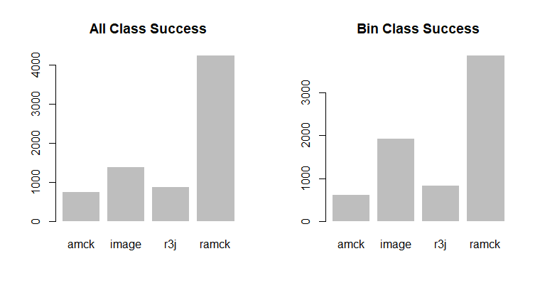

# cellTypePredictor

## Project and main ideas
Cell type classification is used in drug target discovery as well as drug discovery, but identifying cell types can prove to be difficult and time consuming. The way we define cell types is by using a combination of pharmacology, structural identification, to define these cell types. Here in our assay we define the cells mainly using two different assays. This is most easily explained in a [video](https://youtu.be/Ff1E0l2Zlhw?t=342), and for a more in depth discussion on the entire ramifications of this assay watch the whole video. The neurons in our assay are observed in two ways, 
1.	Dynamic depiction:  This is captured by filling the neurons with Fura2, a dye indicative of calcium. Calcium indicates when specific channels (targets of pharmacological intervention) open up. An image is captured every two seconds during these experiments.
2.	Static depiction: neurons can be defined by structural and genetic labeling techniques to help define further what defines these neurons. In this assay we have 2 different markers of pain that label the neurons as green and red (see video 2), as well as size characteristics.

Automatically identifying these depictions to define the neurons cell class has been intensely worked on for the past three years, but a few questions still emerge from this work;
1.	Can this process become completely automated?
2.	Can we gain insight from the automation?

Often when using deep neural networks the interpretability is negligent. Although advances have been made with gradient ascent, obtaining information and structure from this type of work can be difficult. The approach made here is to design a structure of prediction from a compilation of multi-class neural networks to define which model performed the best. We also train a couple of binary classification models to boost the performance of the models.

## Methods

### Data prep
Twenty different experiments were used for this [experiment](./rawData/multiClassData), and an additional [ten](./rawData/binaryClassData) were added for the binary classification problem discussed later.  Experiments are composed as R lists (equivalent to python dictionaries). Within the list are time series data (what we will refer to as traces), and images. 

1.	Image prep: The images are dimension 2048 x 2048 with the images ~ > 2000 cells are captured in a single image. Each neuron (>1000) was selected from each image (20) to have dimensions 41 x 41 pixels. These images were saved as single dimensional numpy array to be unpacked in python to perform the model training. For a collection of the training data see [here](./trainingData). To extract each individual image the experiment were first cleaned using [this script](./dataPrep.R), at the end of that script the function [imageExtractor](./imageExtractor.R) was used to create the images of cells we used to train. See **figure 6** for an example of these images.
2. Trace prep: Traces (see earlier video) mean pixel intensities collected across the total area of the cell while different application of pharmacological agents are applied to the cell. This is transformed into a time series array. One issue was each experiment had differing number of time points for the same application. To deal with this issue the minimun total time points was found across all experiments. Each experiments time series were deleted at regular intervals to equal the minimum allowed size. This method proved more difficult and the script can be found [here](./R/traceExtractor.R). See **figure 6** for an example of these traces.

To define neurons within the cell classification cell types five different pharmacological agents were applied to the neurons (the video above does the best job of describing this). These five pharmacological agents define the ion channel and receptors present on these neurons which are inherent characteristics defining these neurons. 
1. AMCK: applying AITC 100 uM, menthol 400uM, capsaicin 300nM, and potassium 40mM, helps to define neurons in the cell classification scheme below. 
2. RIIIJ: applying a [cone snail](https://www.youtube.com/watch?v=opwGG9_oOjA) derived natural product kM-RIIIJ, provides an additional dimension for defining what cell classification these neurons can possess. 

## Models

### Binary Models 
From **figure 1**, the defining characteristic is the color of the neuron. Here we can see the neuron can either be unlabeled, CGRP (green), or IB4 (red). Since these are defining characteristics, two binary classification models were defined. Using this approach we were able to define CGRP and IB4, with accuracies > 90%, which after auditing the test set was exceptionaly resonably. Additionally, the final layer of the neural network contained softmax activation providing a probablistic perspective on the classification of these cells. These are the script to create [CGRP model](./modelMakers/gfpModel.py), and the [IB4 model](./modelMakers/cy5Model.py). These model are convolution neural networks with dropout, and regularization added to prevent overfitting. The model performance for the CGRP is shown in **figure 2**, and model performance for IB4 is shown in **figure 3**.


**Figure 1:** Cell type classification.


**Figure 2:** Model performance for GFP. Although over-fit, the model performs well enough on th validation test set to continue.


**Figure 3:** Model performance for cy5. Although over-fit, the model performs well enough on the validation test set to continue.

### Multiclass Models
Four multiclass models were created. 
1. An image of brightFeild, CGRP(green), and IB4(red), was used to train a multiclass convolutional neural network, this is shown in **figure 4**.  The success of this model is shown in **figure 5**. Overall this was a very weak model. If i had more time I would assess per class success rate. To view the model see [this](./modelMakers/imageModel.py).

 

**Figure 4:** bright feild overlay

 

**Figure 5:** label model Loss vs Accuracy

2. to understand the traces, three multi-class models were created. These model involved creating custom statistics at regular intervals along the traces. These were fed into a 1 dimension convolution neural network, then max pooled, and then sent into an LSTM. The LSTM had both dropout and recurrent dropout to prevent overfitting. A simple representation of the traces used for these networks are shown in **Figure 6**. Three different LSTM models were designed for this experiment;

    1. [RIIIJ](./modelMakers/r3jModel.py) shown in **figure 7**
    2. [Aitc, menthol, capsaicin K40 (AMCK)](./modelMakers/amckModel.py), shown in **figure 8**.
    3. [RIIIJ and AMCK (RAMCK)](./modelMakers/ramck.py), shown in **figure 9**.

All models were fairly weak for defining the cell types, and the the RAMCK performed the best see **figure 9**.

.  

**Figure 6:** The blue box represent the R3J response types, the red box represent the AMCK response types. Additionally the images on the right present the structural, characteristics of these neurons collected during these experiments.


**Figure 7:** R3J model loss and accuracy. 


**Figure 8:** AMCK model loss and accuracy.


**Figure 9:** R3J and AMCK model loss and accuracy.

All multi-class models were fairly weak, so for the next method we attempted to infer our knowledge onto the system. **figure 1** illustrates the structure that helped to guide the researchers. This is a mixture of image and traces that the researchers used to define the neurons. Therefore the following algorithm was designed to select the correct cell class. To see the actual algorithm and the final work see [here](./puttingItAllTogether.R)

````
# Pseudocode to define the correct multiclass assignment.

for each cell:

    If cell is CGRP(green):
        classesToView <- (5, 6, 7, 8, 9, 10)
    else If cell is IB4(Red):
        classesToView <- (11, 12, 13, 14)
    else
        classesToView <- (1, 2, 3, 4, 14, 15, 16)

    # Collect the model prediction for each cell
    
    # Collect the model without subsetting for comparison
    modelCollection <- matrix()
    # Collect model with classesToView subsetting
    subModelCollections <- matrix()

    # Loop through each model
    for i in  length(model):
        modelCollections[i, ] <- model[cell, ]
        subModelCollections[i, ] <- model[cell, classesToView]

    # Now with each modelCollection collected row sum both matrices
    # Compute the argmax of both to define cell type
    # define cell type selected from each model
    # Compare with correct label.
    Compute loss.

````

## Results 

To observe whether the binary guided classification helped to improve classification a comparison was made to finding the maximum score regardless of the green or red label. This is what I will refer to as All-class. Binary-class is where we define the color of the neuron which subsets the number of cell classes it can be apart of.

Using the binary model to guide the model selection only yielded better results. Binary-class guided success **79.43 %** vs all classifiers to determine the cell type **76.54 %**.

The classifier that dominated the classification was the RAMCK, shown in **figure 10**. Interestingly the image model guided more heavily during the bin class guided modeling.



**Figure 10:** Using all models regardless of the binary classification, vs the selective binary guided multi-class classification.

Diving into the percent success classification can be observed in **Figure 11**. The legend describes all annotations on the figure. Interestingly cell class L1 and L2 have high success rates utilizing the model R3J. This model only observes the region that researchers observe when deciding the cell class for large diameter neurons. One cell class that scored absolutely 0 was the R12. Upon closer inspection the R12 was classified as R13 (46/88) a cell class that closely resembles this cell class. Next most classified for R12 was N14 (22/88), another cell that that closely resembles this cell class. 


**Figure 11:** Each class % correct classification is shown in the the figure. Within each bar the dominate model and the number of cells predicted to be that label out of all cells in that class. Above each bar is the percent of the cell class predicted correctly.


## More Time
Continuing this project I would spend more time on designing models that helped to improved low performing cell classes in the model prediction. For example R11 and R12, both struggled to find success in any models. I'd also like to obtain some cleaner data. Some datasets contain noisy classification, which might be a reason why it is struggling to classify some cell classes. I am interested in attempting to use generative adversarial networks (GAN's) to boost performance of the models. 

I'd also like to create an interactive visualization to look at each individual neuron in conjunction with a figure such as **figure 12**. This could give me more insight when designing the next round of models.


**Figure 12:** This shows a single neuron cell class prediction to each of the four models (amck, image, r3j, ramck). The y axis represents the probability score from each model assigned the the neuron.

Additionally a set of cell classes that struggled a definition were the L3, L4, L5, L6. The dominate model for most of these was the image. I hope to incoporate a better image for the next round. For example, I'd like to use the image which has the roi overlayed on top of the image. I've guessing that this would have better structure for the convolution neural networks to work off of. The image i am going to add for the next series of training is represented in **figure 13**.


**Figure 13:** This is the image which contains the ROI information. I believe the convolution neural net can hone in on the shape of the neuron better to define the size of the cell.


